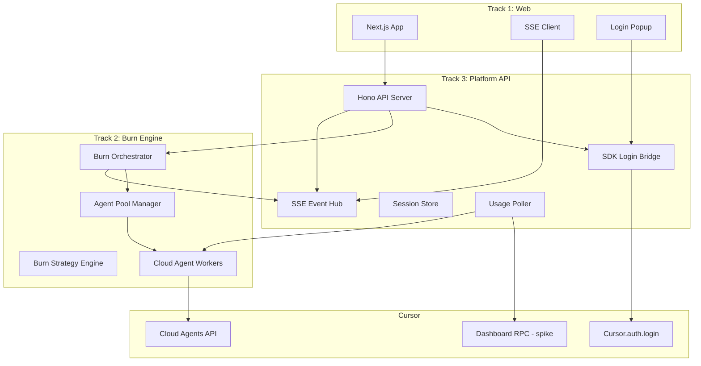
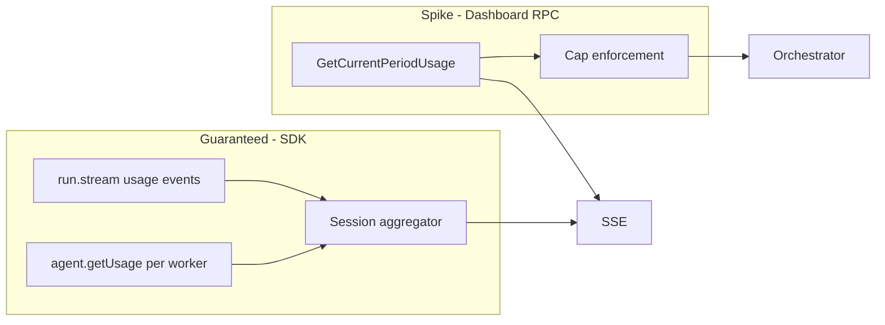

# Cursor Usage Burner — Design Document

## 1. Problem Statement

Build a web app where a user logs into their Cursor account, sets a burn target (percent or dollar cap), and the system automatically consumes their Pro plan included usage as fast as possible using parallel cloud agents. The UI must show **live observability** (burn rate, active agents, usage progress) throughout the session.

**Non-goals:** Tab completion burning (unlimited on Pro), local/desktop agents, malicious credential harvesting patterns, burning past user cap into on-demand billing.

---

## 2. Key Constraints (from Cursor platform research)

| Constraint | Implication |
|------------|-------------|
| No public OAuth for third-party apps | Auth via SDK `Cursor.auth.login()` on the **server**, not a custom OAuth integration |
| User API keys bill to same pools as IDE/SDK | Cloud agents via `@cursor/sdk` are the correct burn primitive |
| Admin/Analytics APIs are Enterprise-only | Cannot rely on official APIs for Pro `Spending %` gauges |
| Undocumented `api2.cursor.sh` Dashboard RPC (`GetCurrentPeriodUsage`) | **Spike required** in Track 3; OpenUsage docs show `totalPercentUsed`, `autoPercentUsed`, `apiPercentUsed` — may work with user-minted API key as Bearer token |
| Rate limits (429) on Cloud Agents API | Adaptive concurrency controller required; burn speed is capped by Cursor, not just our parallelism |
| One active run per cloud agent | Max throughput = N agents × (tokens per multi-turn loop / loop duration) |
| `agent.getUsage()` + `run.stream()` usage events | **Guaranteed** session-level observability regardless of dashboard API spike outcome |

---

## 3. Architecture Overview



### Data flow (happy path)

1. User opens site → clicks **Connect Cursor**
2. API creates auth session → calls `Cursor.auth.login({ onLoginUrl, store: InMemoryCredentialStore })` → returns login URL to frontend
3. Frontend opens popup; user completes Cursor login; server receives minted API key (90-day TTL)
4. API validates key via `Cursor.me({ apiKey })` → creates encrypted burn session
5. User sets cap (e.g. "burn until 95% total spending" or "$15 session budget") and clicks **Start**
6. Orchestrator spawns agent pool (default 15–25 parallel no-repo cloud agents)
7. Each worker runs multi-turn burn loops; events stream to UI via SSE
8. Usage poller checks cap every 5s; orchestrator stops all agents when cap hit or user clicks Stop
9. API key discarded from memory on session end (never persisted to disk in MVP)

---

## 4. Monorepo Structure

```
cursor-throwaway/
├── packages/
│   ├── shared/              # Track 3 — contracts (build first, ~1 day)
│   │   └── src/
│   │       ├── types.ts     # BurnSession, BurnConfig, BurnEvent union
│   │       ├── api.ts       # REST route types + Zod schemas
│   │       └── events.ts    # SSE event payloads
│   ├── burn-engine/         # Track 2
│   │   └── src/
│   │       ├── orchestrator.ts
│   │       ├── pool-manager.ts
│   │       ├── agent-worker.ts
│   │       ├── strategy.ts
│   │       ├── prompts.ts
│   │       ├── concurrency.ts
│   │       └── usage-aggregator.ts
│   ├── api/                 # Track 3
│   │   └── src/
│   │       ├── server.ts
│   │       ├── routes/
│   │       │   ├── auth.ts
│   │       │   ├── session.ts
│   │       │   └── sse.ts
│   │       ├── auth/
│   │       │   └── sdk-login-bridge.ts
│   │       ├── usage/
│   │       │   └── dashboard-poller.ts  # spike
│   │       └── session-store.ts
│   └── web/                 # Track 1
│       └── src/
│           ├── app/         # Next.js App Router pages
│           ├── components/
│           │   ├── UsageGauge.tsx
│           │   ├── BurnRateChart.tsx
│           │   ├── AgentGrid.tsx
│           │   ├── EventLog.tsx
│           │   ├── CapConfigForm.tsx
│           │   └── LoginButton.tsx
│           └── lib/
│               ├── api-client.ts
│               └── sse-hook.ts
├── docs/
│   └── DESIGN.md            # This document
├── package.json             # pnpm workspaces
├── pnpm-workspace.yaml
├── turbo.json
└── docker-compose.yml       # api + web for local dev
```

**Tech stack:** TypeScript, pnpm workspaces, Turborepo, Next.js 15 (web), Hono (api), `@cursor/sdk`, Zod (validation), SSE (no WebSocket needed for MVP).

---

## 5. Three Parallel Build Tracks

Tracks are designed so **three agent swarms can work simultaneously** with minimal merge conflicts. Track 3 publishes `packages/shared` contracts on day 1; other tracks mock against them until integration.

### Track 1 — Web & Observability (`packages/web`)

**Owner scope:** All UI, client-side state, SSE consumption. **No** `@cursor/sdk` imports.

| Deliverable | Description |
|-------------|-------------|
| Login flow UI | Popup window opens Cursor login URL from `POST /auth/login`; polls `GET /auth/status/:sessionId` until `logged-in` |
| Cap config form | User selects cap type (`percent` \| `dollars` \| `session_tokens`) and value before burn |
| Live dashboard | Real-time panels wired to SSE (see §7) |
| Burn controls | Start / Stop / Pause buttons |
| MSW mocks | Full UI functional against mocked API + SSE before backend exists |

**Key pages:**
- `/` — landing + connect
- `/burn` — dashboard (only accessible when authenticated)

**Integration contract:** Depends only on `packages/shared` types. Uses `api-client.ts` + `useBurnEvents()` hook.

---

### Track 2 — Burn Engine (`packages/burn-engine`)

**Owner scope:** All Cursor SDK agent orchestration. **No** HTTP server code.

| Deliverable | Description |
|-------------|-------------|
| `BurnOrchestrator` | Lifecycle: `start(config)`, `stop()`, `pause()`, emits events via callback |
| `PoolManager` | Maintains target concurrency; spawns/recycles cloud agents |
| `AgentWorker` | Single agent burn loop (multi-turn) |
| `BurnStrategy` | Model selection, prompt rotation, follow-up depth |
| `ConcurrencyController` | Adaptive parallelism based on 429 rate |
| `UsageAggregator` | Sums `agent.getUsage()` across active agents |

**Public interface** (implements `packages/shared`):

```typescript
interface BurnEngine {
  start(apiKey: string, config: BurnConfig, onEvent: (e: BurnEvent) => void): Promise<void>;
  stop(): Promise<void>;
  pause(): void;
  resume(): void;
  getSnapshot(): BurnSnapshot;
}
```

**Integration contract:** Unit-testable with a real API key in dev. No knowledge of HTTP/SSE.

---

### Track 3 — Platform, API & Contracts (`packages/shared` + `packages/api`)

**Owner scope:** Shared types, HTTP API, auth bridge, SSE hub, session management, deployment.

| Deliverable | Description |
|-------------|-------------|
| `packages/shared` | Zod schemas + TypeScript types — **ship first** |
| SDK login bridge | Wraps `Cursor.auth.login()` with session-scoped `InMemoryCredentialStore` |
| REST API | Auth, session, burn control endpoints |
| SSE hub | Fan-out `BurnEvent` to connected browser tabs |
| Session store | In-memory Map (MVP); Redis optional later |
| Dashboard poller spike | Attempt `GetCurrentPeriodUsage` with user API key |
| Docker compose | `api` on :3001, `web` on :3000 |

**Integration contract:** Wires `burn-engine` into API routes. Owns all secrets handling.

---

## 6. Burn Speed Optimization Strategy

Goal: maximize tokens consumed per wall-clock second within rate limits.

### 6.1 Parallelism model

```
targetConcurrency = 20        # starting point
minConcurrency = 3
maxConcurrency = 40         # tune empirically

on 429 RateLimitError:
  targetConcurrency *= 0.7
  globalBackoffMs = min(backoff * 2, 60_000)

on 60s without 429:
  targetConcurrency = min(targetConcurrency + 2, maxConcurrency)
```

### 6.2 Agent configuration (per worker)

```typescript
Agent.create({
  apiKey,
  model: strategy.selectModel(),  // see §6.3
  cloud: {
    repos: [],
    metadata: { burn_session: sessionId, worker: workerId },
  },
});
```

### 6.3 Model selection strategy

At session start, call `Cursor.models.list({ apiKey })` and build a ranked list:

| Priority | Model target | Pool burned | Rationale |
|----------|-------------|-------------|-----------|
| 1 | Most expensive third-party (e.g. Opus-class) | Other Models (smaller pool) | Fastest pool depletion |
| 2 | `composer-2.5` + `fast: true` | Cursor Models (larger pool) | High throughput on Cursor models |
| 3 | `auto-smart` + `optimize_for: intelligence` | Both (routed) | Fallback if specific models blocked |

User cap type `percent` maps to stopping when dashboard `totalPercentUsed` ≥ cap.
User cap type `dollars` maps to session `chargedCents` sum ≥ cap × 100.

### 6.4 Per-agent burn loop (maximize tokens per agent)

```
for each agent (parallel):
  repeat until stopped or cap:
    1. send(initialBurnPrompt)     // 500-1000 token prompt, tool-heavy
    2. stream run → emit events
    3. wait for completion
    4. send 3-5 follow-ups:        // "Continue", "Go deeper", "Add 20 more sections"
    5. every 5 turns: recycle agent (fresh context = no cache benefit for Cursor)
```

### 6.5 Prompt design (`packages/burn-engine/src/prompts.ts`)

Prompts optimized for **long outputs + tool use**, rotated to avoid prompt cache hits:

- "Research and compare 30 programming languages across 15 dimensions. Use web search for each."
- "Write exhaustive documentation for a fictional 50-module ERP system..."
- "Analyze security vulnerabilities in 25 common web frameworks..."

Include `webSearch` tool usage where available (extra model round-trips).

### 6.6 Subagents (phase 2 enhancement)

Spawn workers with inline subagent definitions to multiply tool calls per parent run. Defer to post-MVP if complexity blocks Track 2 timeline.

---

## 7. Live Observability (SSE)

### 7.1 Event schema (`packages/shared/src/events.ts`)

```typescript
type BurnEvent =
  | { type: "session.started"; sessionId: string; config: BurnConfig; at: string }
  | { type: "session.stopped"; reason: "cap_reached" | "user" | "error"; at: string }
  | { type: "auth.ok"; email?: string }
  | { type: "agent.spawned"; agentId: string; workerId: number }
  | { type: "agent.recycled"; agentId: string; turnsCompleted: number }
  | { type: "run.started"; agentId: string; runId: string; model: string }
  | { type: "run.completed"; agentId: string; runId: string; usage: TokenUsage; durationMs: number }
  | { type: "usage.snapshot";           // emitted every 3-5s
      session: { tokens: number; costCents: number; tokensPerSec: number };
      account?: {                        // if dashboard API works
        totalPercent: number;
        autoPercent: number;
        apiPercent: number;
        includedSpendCents: number;
        limitCents: number;
      };
      cap: { type: string; target: number; current: number; remaining: number };
      activeAgents: number;
      at: string;
    }
  | { type: "concurrency.adjusted"; from: number; to: number; reason: string }
  | { type: "rate_limit"; retryInMs: number; concurrency: number }
  | { type: "error"; message: string; recoverable: boolean };
```

### 7.2 UI panels (Track 1)

| Panel | Data source | Update freq |
|-------|-------------|-------------|
| **Cap progress ring** | `usage.snapshot.cap` | 3-5s |
| **Account spending bars** | `usage.snapshot.account` (auto / api / total %) | 3-5s |
| **Burn rate** | `usage.snapshot.session.tokensPerSec` | 3-5s |
| **Session totals** | tokens + cost this session | 3-5s |
| **Active agents grid** | `agent.spawned` / `run.started` / `run.completed` | real-time |
| **Event log** | all events (scrollable, last 200) | real-time |
| **Concurrency indicator** | `concurrency.adjusted` | on change |

### 7.3 Usage measurement layers



**MVP fallback:** If dashboard RPC fails with user API key, show session-relative metrics only and enforce dollar/token caps via `agent.getUsage()` sums. Display banner: "Account % unavailable — showing session burn only."

**Dashboard RPC spike** (Track 3, day 1-2):

```
POST https://api2.cursor.sh/aiserver.v1.DashboardService/GetCurrentPeriodUsage
Authorization: Bearer <userApiKey>
```

Validate response fields: `totalPercentUsed`, `autoPercentUsed`, `apiPercentUsed`, `includedSpend`, `limit`.

---

## 8. API Specification

### Auth

| Method | Path | Description |
|--------|------|-------------|
| `POST` | `/auth/login` | Start SDK login; returns `{ sessionId, loginUrl }` |
| `GET` | `/auth/status/:sessionId` | Poll: `pending` \| `logged-in` \| `expired` \| `error` |
| `POST` | `/auth/logout` | Clear session + revoke in-memory key |

### Burn session

| Method | Path | Description |
|--------|------|-------------|
| `POST` | `/burn/start` | Body: `BurnConfig` (cap type, value, model preference) |
| `POST` | `/burn/stop` | Stop orchestrator |
| `POST` | `/burn/pause` | Pause spawning new runs |
| `GET` | `/burn/status` | Current `BurnSnapshot` |
| `GET` | `/burn/events` | SSE stream (`text/event-stream`) |

### `BurnConfig` schema

```typescript
interface BurnConfig {
  cap: {
    type: "percent" | "dollars" | "session_tokens";
    value: number;           // e.g. 95 (%), 15 ($), 10_000_000 (tokens)
  };
  modelPreference: "fastest_pool" | "cursor_models" | "other_models";
  initialConcurrency?: number;  // default 20
}
```

---

## 9. Security Model

| Risk | Mitigation |
|------|------------|
| API key theft | Keys held in server memory only; AES-256 encrypted in session store with per-session key; TTL 24h max; never logged |
| Burn past user cap | Cap enforced server-side; poll before each spawn wave |
| On-demand billing | Dollar cap uses `chargedCents` from SDK; percent cap uses dashboard poller; default cap type = `percent` at 100 |
| CSRF on burn start | Session cookie + SameSite=strict |
| Abuse (draining others' accounts) | Require explicit cap confirmation checkbox; show email from `Cursor.me()` |

---

## 10. Track Dependencies & Integration Milestones

### Merge conflict boundaries

| Track | Owns | Must NOT touch |
|-------|------|----------------|
| Track 1 | `packages/web/**` | `burn-engine`, `api` |
| Track 2 | `packages/burn-engine/**` | `web`, `api` routes |
| Track 3 | `packages/shared/**`, `packages/api/**`, root infra | `web` components |

**Only shared touchpoint:** `packages/shared` — Track 3 owns it; Tracks 1 & 2 propose changes via PR to shared types only.

### Implementation todos

1. **Track 3 (day 1 blocker):** Create `packages/shared` with `BurnConfig`, `BurnEvent`, API Zod schemas
2. **Track 3:** Spike `GetCurrentPeriodUsage` with user API key
3. **Track 2:** Implement `BurnOrchestrator`, `PoolManager`, `AgentWorker`, `ConcurrencyController`, prompt library
4. **Track 3:** Hono API with SDK login bridge, session store, SSE hub, burn route wiring
5. **Track 1:** Next.js UI with login popup, cap form, live SSE dashboard
6. **Integration:** Wire burn-engine into API, connect web to real SSE, end-to-end burn test with cap enforcement

---

## 11. Testing Strategy

| Layer | Approach |
|-------|----------|
| `burn-engine` | Unit tests with mocked `Agent` interface; integration test with real API key (manual, env-gated) |
| `api` | Supertest against Hono routes; mock `BurnEngine` |
| `web` | Vitest component tests; Playwright E2E against MSW then staging |
| Burn perf | Script: measure tokens/sec at concurrency 10/20/30; document optimal default |

---

## 12. Deployment (MVP)

- **Web:** Vercel (Next.js)
- **API:** Railway or Fly.io (long-running process required for orchestrator + SSE)
- **Env vars:** `SESSION_SECRET`, `CURSOR_BACKEND_URL` (optional override)
- Single API instance for MVP (orchestrator is in-process; no separate worker queue yet)

---

## 13. Open Questions / Phase 2

- Subagent multiplication for higher burn per agent
- Redis session store for multi-instance API
- Pool-specific burn modes ("drain Other Models first, then Cursor Models")
- `Cursor.auth.login()` in serverless — may require always-on API process (not Vercel serverless for orchestrator)
- Official dashboard API if Cursor exposes it to user API keys
