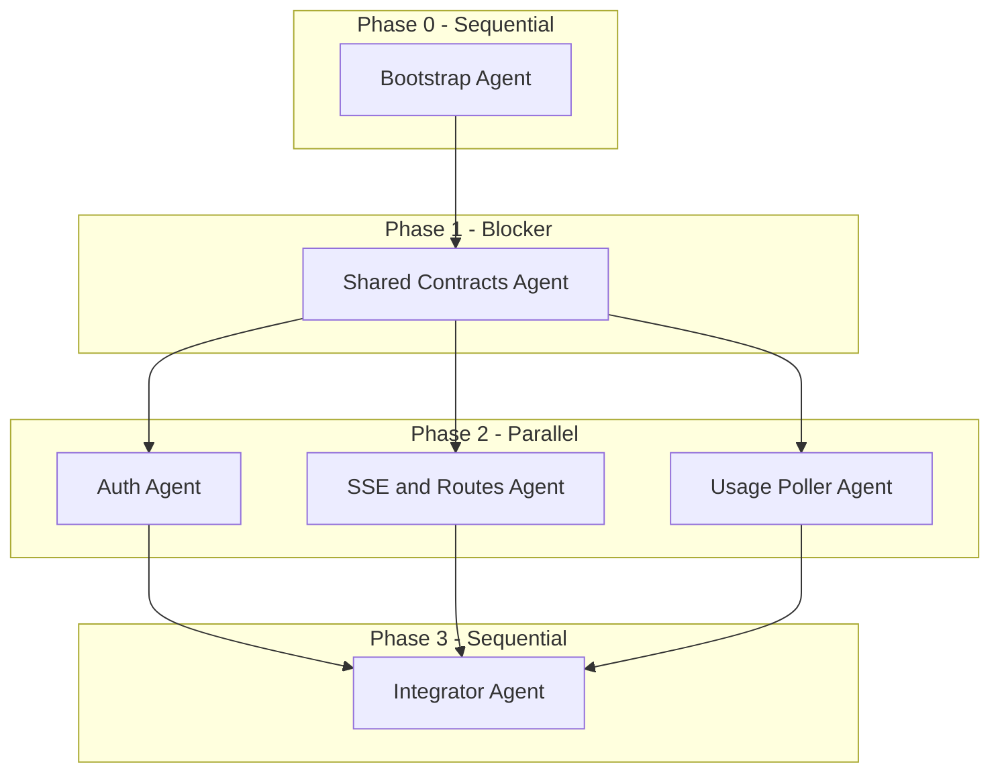

# Track 3 Agent Swarm Execution Plan

Track 3 is the **day-1 blocker** for Tracks 1 and 2. Nothing else can integrate until `packages/shared` is published and the API skeleton is running.

Reference: [DESIGN.md](./DESIGN.md) sections 4, 5 (Track 3), 7, 8, 9.

**Target branch:** `track-3/platform` (branch off `main`, PR when done)

---

## Swarm topology



| Phase | Agent role | Parallel? | Blocks |
|-------|-----------|-----------|--------|
| 0 | Bootstrap | No | Everything |
| 1 | Shared Contracts | No | Phase 2 |
| 2a | Auth + Session | Yes (with 2b, 2c) | Integrator |
| 2b | SSE + Burn Routes | Yes | Integrator |
| 2c | Dashboard Poller | Yes | Integrator |
| 3 | Integrator | No | Tracks 1 & 2 |

---

## Phase 0 — Bootstrap Agent (1 agent, ~30 min)

**Goal:** Monorepo skeleton so all packages can be added without conflicts.

### Owns (only these files)

```
package.json
tsconfig.base.json
.gitignore
packages/shared/package.json   (empty shell only)
packages/api/package.json      (empty shell only)
```

### Tasks

1. npm workspaces root (`packages/*`)
2. Shared `tsconfig.base.json` (ES2022, NodeNext, strict)
3. `.gitignore`: `node_modules`, `dist`, `.env`, `.env.local`
4. Root scripts: `build`, `dev:api`, `typecheck`
5. Node **22.13+** requirement documented in README addendum

### Done when

- `npm install` succeeds at root
- Both package shells exist with `@cursor-burner/shared` and `@cursor-burner/api` names

### Agent prompt

```
You are building Phase 0 of Track 3 for cursor-throwaway.
Read docs/DESIGN.md sections 4 and 5 (Track 3).

Create ONLY the monorepo bootstrap:
- Root package.json with npm workspaces for packages/*
- tsconfig.base.json
- .gitignore
- Empty package.json shells for packages/shared and packages/api

Do NOT implement shared types or API logic yet.
Do NOT touch packages/web or packages/burn-engine.
Commit to branch track-3/platform.
```

---

## Phase 1 — Shared Contracts Agent (1 agent, ~2 hrs) **BLOCKER**

**Goal:** Ship `packages/shared` — the contract every other track depends on.

### Owns

```
packages/shared/**
```

### Must implement (from DESIGN §7.1, §8)

| File | Contents |
|------|----------|
| `src/api.ts` | Zod schemas: `BurnConfig`, `CapType`, `ModelPreference`, `AuthLoginResponse`, `AuthStatus`, `BurnStartRequest`, `BurnStatusResponse` |
| `src/events.ts` | `BurnEvent` discriminated union (all 12 event types) |
| `src/types.ts` | `TokenUsage`, `BurnSession`, `BurnSnapshot`, `AccountUsage`, `CapProgress`, `BurnEngine` interface |
| `src/index.ts` | Re-exports |

### Acceptance criteria

- `npm run build -w @cursor-burner/shared` passes
- All Zod schemas match DESIGN §8 exactly
- `BurnEvent` union is exhaustive per DESIGN §7.1
- Export `isBurnEvent()` type guard
- **No** `@cursor/sdk` dependency in shared

### Agent prompt

```
You are the Shared Contracts Agent for cursor-throwaway Track 3.
Read docs/DESIGN.md sections 7.1, 8, and Track 3 deliverables.

Implement packages/shared completely:
- Zod schemas in api.ts (BurnConfig, auth responses, burn status)
- BurnEvent union in events.ts (all 12 event types from design doc)
- types.ts with TokenUsage, BurnSession, BurnSnapshot, BurnEngine interface
- Build with tsc, export from index.ts

This package is the contract for Tracks 1 and 2. Match the design doc exactly.
Do not add @cursor/sdk. Do not touch packages/api yet.
Branch: track-3/platform. Commit when build passes.
```

**Handoff:** After merge, Tracks 1 & 2 can mock against `@cursor-burner/shared` types.

---

## Phase 2 — Three parallel agents

All three start **only after Phase 1 merges**. Each agent works in isolated directories.

### Merge conflict boundaries

| Agent | Owns | Must NOT touch |
|-------|------|----------------|
| **2a Auth** | `packages/api/src/auth/**`, `packages/api/src/session-store.ts`, `packages/api/src/crypto.ts`, `packages/api/src/routes/auth.ts` | `routes/burn.ts`, `routes/sse.ts`, `sse/`, `usage/` |
| **2b SSE** | `packages/api/src/sse/**`, `packages/api/src/routes/burn.ts`, `packages/api/src/routes/sse.ts`, `packages/api/src/burn-controller.ts` | `auth/`, `session-store.ts`, `usage/` |
| **2c Usage** | `packages/api/src/usage/**`, `packages/api/src/types/dashboard.ts` | `auth/`, `routes/`, `sse/` |

`packages/api/src/server.ts` is **Integrator-only**. Phase 2 agents export mountable routers/factories.

---

### Agent 2a — Auth + Session Store

**Files:**

```
packages/api/src/auth/sdk-login-bridge.ts
packages/api/src/session-store.ts
packages/api/src/crypto.ts
packages/api/src/routes/auth.ts
```

**SDK login bridge:**
- Wrap `Cursor.auth.login()` with per-session `InMemoryCredentialStore`
- `onLoginUrl` callback stores URL for frontend polling
- On success: `Cursor.me({ apiKey })` to validate, return email
- TTL: 10 min pending auth, 24h authenticated session

**Session store:**
- `Map<sessionId, SessionRecord>`
- API keys encrypted AES-256-GCM with `SESSION_SECRET` + per-session salt
- Methods: `create()`, `get()`, `setApiKey()`, `clear()`, `cleanupExpired()`

**Auth routes:**

| Route | Behavior |
|-------|----------|
| `POST /auth/login` | Start login, return `{ sessionId, loginUrl }` |
| `GET /auth/status/:sessionId` | Return `AuthStatus` from shared |
| `POST /auth/logout` | Clear session, wipe key from memory |

Export: `createAuthRouter(sessionStore, loginBridge)`

### Agent prompt (2a)

```
You are Auth Agent (2a) for cursor-throwaway Track 3.
Depends on @cursor-burner/shared (already built).

Implement:
1. packages/api/src/crypto.ts - AES-256-GCM encrypt/decrypt for API keys
2. packages/api/src/session-store.ts - in-memory Map, 24h TTL, encrypted keys
3. packages/api/src/auth/sdk-login-bridge.ts - wraps Cursor.auth.login()
   with InMemoryCredentialStore, onLoginUrl callback, Cursor.me() validation
4. packages/api/src/routes/auth.ts - POST /auth/login, GET /auth/status/:id, POST /auth/logout

Export createAuthRouter() - do NOT write server.ts.
Use @cursor/sdk for Cursor.auth.login and Cursor.me.
Match API spec in docs/DESIGN.md section 8.
Never log API keys. Branch: track-3/platform.
```

---

### Agent 2b — SSE Hub + Burn Routes

**Files:**

```
packages/api/src/sse/event-hub.ts
packages/api/src/sse/sse-handler.ts
packages/api/src/routes/burn.ts
packages/api/src/routes/sse.ts
packages/api/src/burn-controller.ts
```

**Event hub:** pub/sub per `sessionId`, fan-out `BurnEvent` to all SSE clients.

**SSE:** `GET /burn/events` as `text/event-stream`, heartbeat every 15s, cleanup on disconnect.

**Burn controller:**
- Holds `BurnEngine | null` (interface from shared)
- **MVP:** `MockBurnEngine` emitting fake `usage.snapshot` every 3s
- On every engine event → `eventHub.publish(sessionId, event)`

**Burn routes:**

| Route | Behavior |
|-------|----------|
| `POST /burn/start` | Validate session has API key, parse `BurnConfig`, start engine |
| `POST /burn/stop` | Stop engine |
| `POST /burn/pause` | Pause engine |
| `GET /burn/status` | Return `BurnStatusResponse` |

Export: `createBurnRouter(burnController, sessionStore)`

### Agent prompt (2b)

```
You are SSE + Routes Agent (2b) for cursor-throwaway Track 3.
Depends on @cursor-burner/shared.

Implement:
1. packages/api/src/sse/event-hub.ts - pub/sub per sessionId
2. packages/api/src/sse/sse-handler.ts - GET /burn/events SSE stream with heartbeat
3. packages/api/src/burn-controller.ts - BurnEngine wrapper with MockBurnEngine
   that emits realistic BurnEvents (agent.spawned, run.started, usage.snapshot every 3s)
4. packages/api/src/routes/burn.ts - POST /burn/start|stop|pause, GET /burn/status
5. packages/api/src/routes/sse.ts - mounts SSE endpoint

Export createBurnRouter() and createSseRouter().
Do NOT write server.ts or touch auth/ or usage/.
MockBurnEngine must implement BurnEngine interface from shared.
Branch: track-3/platform.
```

---

### Agent 2c — Dashboard Usage Poller (spike)

**Files:**

```
packages/api/src/usage/dashboard-poller.ts
packages/api/src/types/dashboard.ts
packages/api/src/usage/cap-checker.ts
```

**Dashboard poller:**

```typescript
async function fetchCurrentPeriodUsage(apiKey: string): Promise<DashboardUsage | null>
```

Try:
```
POST https://api2.cursor.sh/aiserver.v1.DashboardService/GetCurrentPeriodUsage
Authorization: Bearer <userApiKey>
```

Parse: `totalPercentUsed`, `autoPercentUsed`, `apiPercentUsed`, `includedSpend`, `limit`. Return `null` on failure.

**Cap checker:**

```typescript
function isCapReached(config: BurnConfig, session: SessionMetrics, account?: DashboardUsage): boolean
```

- `percent` → `account.totalPercent >= cap.value` (false if account null)
- `dollars` → `session.costCents >= cap.value * 100`
- `session_tokens` → `session.tokens >= cap.value`

### Agent prompt (2c)

```
You are Usage Poller Agent (2c) for cursor-throwaway Track 3.
Depends on @cursor-burner/shared.

Spike and implement:
1. packages/api/src/types/dashboard.ts - response types for GetCurrentPeriodUsage
2. packages/api/src/usage/dashboard-poller.ts - fetch with Bearer apiKey, return null on failure
3. packages/api/src/usage/cap-checker.ts - isCapReached() and buildCapProgress() per DESIGN

Do NOT write server.ts or routes. Export functions only.
Add a small test or script documenting spike result (works/fails with user key).
Branch: track-3/platform.
```

---

## Phase 3 — Integrator Agent (1 agent, ~2 hrs)

**Owns:**

```
packages/api/src/server.ts
packages/api/package.json
packages/api/tsconfig.json
docker-compose.yml
.env.example
README.md (Track 3 dev instructions)
```

### Tasks

1. Hono app with CORS (`localhost:3000`), cookie middleware
2. Mount all routers from Phase 2
3. Session cookie: `burn_session=<sessionId>` HttpOnly, SameSite=Strict
4. Wire dashboard-poller into burn-controller snapshot loop (every 5s)
5. `MockBurnEngine` stays until Track 2 integrates
6. `docker-compose.yml`: api on `:3001`
7. `npm run dev:api` via `@hono/node-server`

### Agent prompt (Integrator)

```
You are Integrator Agent (Phase 3) for cursor-throwaway Track 3.
Merge work from Auth (2a), SSE (2b), and Usage (2c) agents.

Implement packages/api/src/server.ts:
- Hono app mounting all routers
- CORS for localhost:3000
- Session cookie middleware
- Wire dashboard-poller into burn-controller snapshot interval

Add docker-compose.yml, .env.example, update README with:
  npm install && npm run dev:api

Verify all endpoints from DESIGN section 8 work.
Keep MockBurnEngine until Track 2 integrates.
Branch: track-3/platform. Open PR to main when done.
```

---

## Launch sequence

### Step 1 — Sequential (you or one agent)

```
Agent 1: Phase 0 prompt → commit
Agent 2: Phase 1 prompt → commit → push
```

**Checkpoint:** Tracks 1 & 2 can start mocking `@cursor-burner/shared`.

### Step 2 — Three agents in parallel

Launch in a single turn with three Task/subagent calls:

- Task A: Agent 2a prompt (auth)
- Task B: Agent 2b prompt (SSE + routes)
- Task C: Agent 2c prompt (usage poller)

### Step 3 — Integrator after all 3 complete

```
Agent 4: Phase 3 integrator prompt
```

### Step 4 — PR

```bash
git push -u origin track-3/platform
gh pr create --title "Track 3: Platform API + shared contracts" ...
```

---

## Verification checklist (before merge)

- [ ] `packages/shared` builds; exports match DESIGN §7–8
- [ ] `POST /auth/login` returns login URL
- [ ] `GET /auth/status/:id` returns pending → logged-in flow
- [ ] `POST /burn/start` starts mock burn
- [ ] `GET /burn/events` streams `usage.snapshot` every 3–5s
- [ ] `POST /burn/stop` emits `session.stopped`
- [ ] Dashboard poller spike documented (works or fallback confirmed)
- [ ] API keys never in logs
- [ ] Cap checker tests pass for all 3 cap types
- [ ] README has `npm run dev:api` instructions

---

## Handoff to Tracks 1 & 2

| Track | After Track 3 merges |
|-------|---------------------|
| **Track 1 (web)** | Point API client at `localhost:3001`, consume real SSE |
| **Track 2 (burn-engine)** | Implement `BurnEngine`, swap `MockBurnEngine` in `burn-controller.ts` |

Track 2 integration is one swap:

```typescript
// import { BurnOrchestrator } from '@cursor-burner/burn-engine';
// this.engine = new BurnOrchestrator();
```

---

## Risks

| Risk | Mitigation |
|------|------------|
| `Cursor.auth.login()` needs browser on server | Long-lived Node process, not serverless |
| Dashboard RPC fails with user API key | Cap checker falls back to session-only metrics |
| Phase 2 merge conflicts | Strict directory ownership; integrator owns `server.ts` only |
| Shared schema drift | Phase 1 is sole owner of `packages/shared` |
